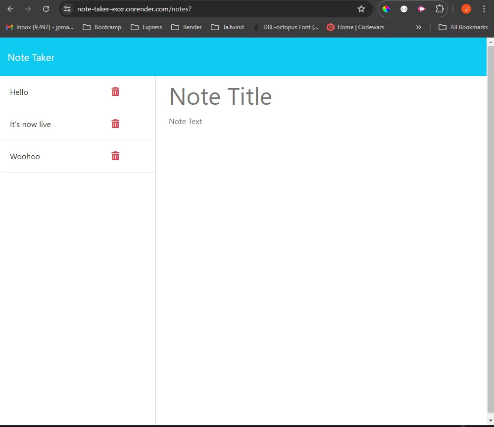

# Module 11 Express.js Challenge: Note Taker

## Description of the Application

This is a simple web application that allows users to write and save notes for later retrieval, editing, or deleting. It uses an express.js backend and saves and retrieves the notes data from a JSON file. 

## Screenshot of Application

The following is a screenshot of the application deployed and accessible through Render hosting. 

## Links

The application is deployed through Render and may be accessed at the following URL: [https://note-taker-exxr.onrender.com/notes.](https://note-taker-exxr.onrender.com/notes)

The GitHub repository for the application may be accessed by clicking [here.](https://github.com/mankovich/note-taker)

---

&copy;2024 Mankovich, a person. All rights reserved. 